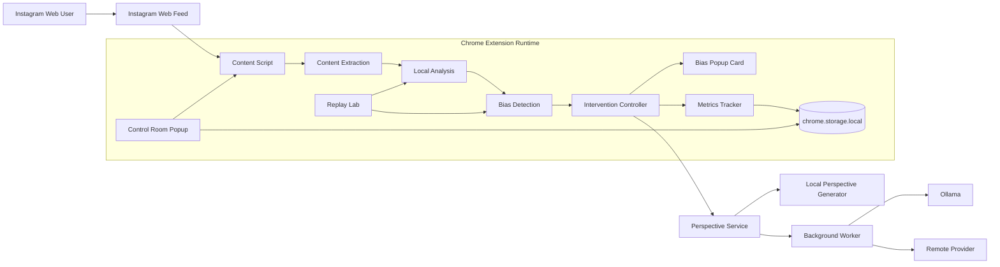
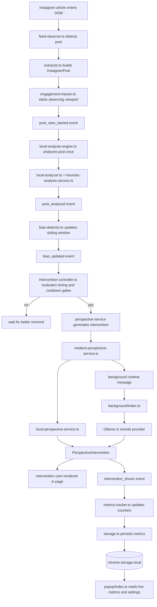

# MindLens Architecture

This document gives a concise, shareable view of how MindLens works at both the system and implementation levels.

## High-Level Diagram

### What this shows

- Instagram content is read only from the visible web page DOM
- the default analysis and scoring path stays inside the browser
- intervention generation can come from:
  - local fallback generation
  - Ollama
  - a future remote provider
- popup, metrics, and replay tooling are all built around the same core pipeline

## Low-Level Runtime Flow

### What this shows

- posts are now analyzed on meaningful viewport entry, not just when Instagram pre-renders them
- the event bus is the backbone of the runtime
- bias detection and intervention timing are separate concerns
- provider generation is abstracted behind a service layer
- metrics and popup state are derived from the same event-driven pipeline

## Module Map

### Content Script Runtime

- [`src/content/index.ts`](https://github.com/mazharxcodes/mindlens/blob/main/src/content/index.ts)
  Bootstrap, debug API, wiring between modules
- [`src/content/feed-observer.ts`](https://github.com/mazharxcodes/mindlens/blob/main/src/content/feed-observer.ts)
  Detects Instagram feed posts in the DOM
- [`src/content/extractor.ts`](https://github.com/mazharxcodes/mindlens/blob/main/src/content/extractor.ts)
  Extracts normalized post text and identifiers
- [`src/content/engagement-tracker.ts`](https://github.com/mazharxcodes/mindlens/blob/main/src/content/engagement-tracker.ts)
  Tracks viewport entry and dwell timing
- [`src/content/scroll-tracker.ts`](https://github.com/mazharxcodes/mindlens/blob/main/src/content/scroll-tracker.ts)
  Emits scroll velocity/activity signals
- [`src/content/local-analysis-engine.ts`](https://github.com/mazharxcodes/mindlens/blob/main/src/content/local-analysis-engine.ts)
  Runs one-time analysis per viewed post
- [`src/content/local-analyzer.ts`](https://github.com/mazharxcodes/mindlens/blob/main/src/content/local-analyzer.ts)
  Heuristic classifier logic
- [`src/content/bias-detector.ts`](https://github.com/mazharxcodes/mindlens/blob/main/src/content/bias-detector.ts)
  Sliding-window bias scoring
- [`src/content/intervention-controller.ts`](https://github.com/mazharxcodes/mindlens/blob/main/src/content/intervention-controller.ts)
  Prompt timing, rendering, dismissal, forced test prompts
- [`src/content/metrics-tracker.ts`](https://github.com/mazharxcodes/mindlens/blob/main/src/content/metrics-tracker.ts)
  Intervention metrics and persistence

### Provider Layer

- [`src/content/perspective-service.ts`](https://github.com/mazharxcodes/mindlens/blob/main/src/content/perspective-service.ts)
  Perspective generation interface
- [`src/content/local-perspective-service.ts`](https://github.com/mazharxcodes/mindlens/blob/main/src/content/local-perspective-service.ts)
  Built-in fallback provider
- [`src/content/perspective-generator.ts`](https://github.com/mazharxcodes/mindlens/blob/main/src/content/perspective-generator.ts)
  Local copy generation templates
- [`src/content/resilient-perspective-service.ts`](https://github.com/mazharxcodes/mindlens/blob/main/src/content/resilient-perspective-service.ts)
  Fallback and provider health logic
- [`src/content/provider-registry.ts`](https://github.com/mazharxcodes/mindlens/blob/main/src/content/provider-registry.ts)
  Provider wiring

### Background and UI

- [`src/background/index.ts`](https://github.com/mazharxcodes/mindlens/blob/main/src/background/index.ts)
  Handles Ollama/remote generation requests
- [`src/popup/index.ts`](https://github.com/mazharxcodes/mindlens/blob/main/src/popup/index.ts)
  Control Room UI
- [`src/harness/index.ts`](https://github.com/mazharxcodes/mindlens/blob/main/src/harness/index.ts)
  Replay Lab for deterministic testing

## Suggested Talking Track

When explaining MindLens to someone else, a good short walkthrough is:

1. The extension watches Instagram Web posts as they enter view.
2. It classifies what kind of content the user is consuming and how one-sided it is becoming.
3. It builds a rolling bias score from recent viewed posts.
4. When the score is high and the moment is right, it generates a fuller-perspective intervention.
5. It tracks whether the user reads, expands, or dismisses that intervention.
